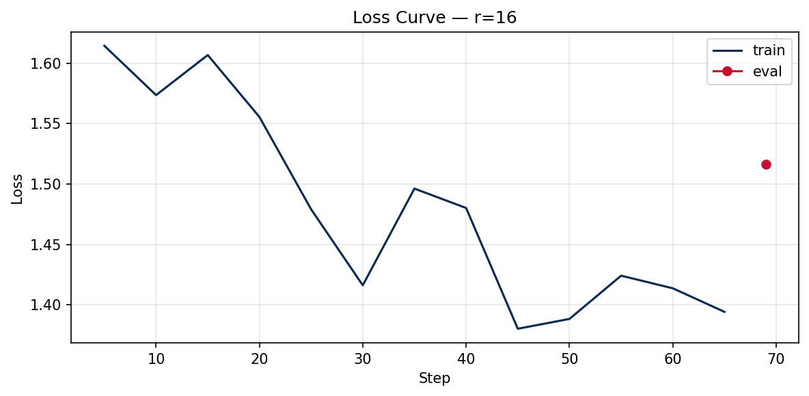

# Lab 21 — Evaluation Report

**Học viên**: Võ Thanh Chung - 2A202600335  
**Ngày nộp**: 2026-05-07  
**Submission option**: A — Lightweight ZIP

---

## 1. Setup

- **Base model**: `unsloth/Qwen2.5-3B-bnb-4bit`
- **Fine-tuning method**: QLoRA, using a 4-bit quantized base model and LoRA adapters
- **Adapter submitted**: `r16`, because it provides the best practical trade-off between quality and adapter size
- **Dataset**: `5CD-AI/Vietnamese-alpaca-gpt4-gg-translated`
- **Dataset size**: 200 samples: 180 train + 20 eval
- **Split ratio**: 90/10, random seed = 42
- **Dataset format**: Vietnamese Alpaca-style instruction tuning format (`instruction_vi`, `input_vi`, `output_vi`)
- **Max sequence length cap**: 1024
- **GPU**: Tesla T4, approximately 14.6 GB available VRAM in Colab
- **Precision**: fp16 on T4, with 4-bit quantized base model
- **Training cost estimate**: about `$0.07`, assuming `$0.35/hour` and 11.65 total training minutes for the three adapter runs.

### Training configuration

| Parameter | Value |
|---|---|
| Target modules | `q_proj`, `v_proj` |
| LoRA dropout | 0 |
| Bias | `none` |
| Gradient checkpointing | `unsloth` |
| Random state | 42 |
| Optimizer | `adamw_8bit` |
| Epochs | 3 |
| Learning rate | 2e-4 |
| LR scheduler | cosine |
| Warmup ratio | 0.10 |
| Effective batch size | 8 |
| Evaluation during training | disabled to reduce T4 VRAM usage |
| Packing | `False` |

---

## 2. Rank Experiment Results

| Rank | Alpha | Trainable Params | Train Time | Peak VRAM | Eval Loss | Perplexity |
|---:|---:|---:|---:|---:|---:|---:|
| Base | - | 0 | 0.00 min | 0.00 GB | NaN | NaN |
| 8 | 16 | 1,843,200 | 3.82 min | 7.22 GB | 1.5577 | 4.7479 |
| 16 | 32 | 3,686,400 | 4.02 min | 6.62 GB | 1.5161 | 4.5544 |
| 64 | 128 | 14,745,600 | 3.81 min | 8.00 GB | 1.4768 | 4.3790 |

The base model row is included for completeness, but base perplexity evaluation returned `NaN` in this run. The three trained adapters were evaluated successfully.

### Observations

- `r=8` used the fewest trainable parameters, but it produced the highest eval loss and perplexity among the three adapters.
- `r=16` improved perplexity compared with `r=8` while keeping the adapter size small.
- `r=64` achieved the best perplexity, but it required 14,745,600 trainable parameters, which is 4 times larger than `r=16` and 8 times larger than `r=8`.
- The perplexity improvement from `r=16` to `r=64` was relatively small compared with the increase in trainable parameters. This suggests diminishing returns on this small 200-sample dataset.

---

## 3. Loss Curve Analysis

The notebook logs training loss during supervised fine-tuning. Evaluation during training was disabled because this T4 profile prioritizes avoiding out-of-memory errors. Final eval loss was computed after each adapter was saved.

The final metrics show a consistent decrease in eval loss as rank increases: `r=8` had eval loss 1.5577, `r=16` had eval loss 1.5161, and `r=64` had eval loss 1.4768. This means the higher-rank adapters had more capacity to fit the Vietnamese Alpaca-format data. However, because the dataset has only 180 training samples, the higher-capacity `r=64` adapter may also have a higher risk of memorizing dataset-specific style or noise.

The qualitative results also show why loss/perplexity should not be the only evaluation method. Although `r=64` achieved the best perplexity and `r=16` performed well overall, the fine-tuned model still hallucinated in the LoRA/QLoRA prompt. Therefore, the training loss and eval perplexity are useful quantitative indicators, but qualitative checking remains necessary for factual correctness and instruction-following quality.

---

## 4. Qualitative Comparison

The following examples compare the base model with the `r=16` fine-tuned adapter. I selected `r=16` for qualitative comparison because it is the baseline rank and the most practical deployment choice in this experiment.

### Example 1

**Prompt**: Giải thích khái niệm machine learning cho người mới bắt đầu.

**Base model**: Machine learning là một phân khúc của trí tuệ nhân tạo, tập trung vào việc thiết lập các mô hình máy móc để học từ dữ liệu và từ đó có thể dự đoán hoặc hành động.

**Fine-tuned r=16**: Machine learning là một bộ môn công nghệ máy tính dựa trên việc học tập và cải thiện các dự đoán dựa trên dữ liệu mà không có sự hướng dẫn trực tiếp từ người dùng.

**Nhận xét**: Fine-tuned response diễn đạt tự nhiên hơn và giải thích rõ hơn cho người mới bắt đầu. Đây là một improvement nhẹ.

### Example 2

**Prompt**: Viết đoạn code Python tính số Fibonacci thứ n.

**Base model**: Base model đưa ra một hàm Fibonacci dạng vòng lặp, nhưng xử lý `n <= 0` bằng cách trả về string và định nghĩa `n == 1` trả về 0, `n == 2` trả về 1.

**Fine-tuned r=16**: Fine-tuned model đưa ra hàm có kiểm tra input âm bằng `ValueError`, xử lý `n == 0`, `n == 1`, và vòng lặp O(n) với bộ nhớ O(1).

**Nhận xét**: Fine-tuned response tốt hơn vì code rõ ràng hơn, có validation tốt hơn, và có thêm phân tích độ phức tạp.

### Example 3

**Prompt**: Liệt kê 5 nguyên tắc thiết kế UI/UX.

**Base model**: Base model liệt kê các nguyên tắc như thân thiện với người dùng, truy cập khả thi, bố cục, màu sắc, font chữ và các yếu tố trải nghiệm.

**Fine-tuned r=16**: Fine-tuned model liệt kê chuyển đổi, thích ứng, đơn giản, tương thích và nội dung.

**Nhận xét**: Base model tốt hơn ở prompt này. Fine-tuned response có cấu trúc ngắn gọn, nhưng một số ý như “chuyển đổi” và “tương thích” chưa phải các nguyên tắc UI/UX cốt lõi nhất. Đây là một case degraded nhẹ.

### Example 4

**Prompt**: Tóm tắt sự khác biệt giữa LoRA và QLoRA.

**Base model**: Base model nhận diện đúng LoRA là Low-Rank Adaptation và QLoRA là Quantized LoRA, dù phần giải thích vẫn còn khá chung chung.

**Fine-tuned r=16**: Fine-tuned model mô tả LoRA sai thành “Layer-wise Adaptive Regularization Optimization” và gọi LoRA/QLoRA là regularization methods.

**Nhận xét**: Đây là case degraded rõ ràng. Fine-tuning không đảm bảo sửa factual knowledge, đặc biệt khi dataset nhỏ và không chuyên về LoRA/QLoRA. Kết quả này củng cố nguyên tắc: fine-tuning phù hợp cho style/format, còn knowledge gap nên dùng RAG hoặc dataset chuyên môn chất lượng cao.

### Example 5

**Prompt**: Phân biệt prompt engineering, RAG, và fine-tuning.

**Base model**: Base model giải thích prompt engineering, RAG và fine-tuning là ba cách khác nhau để cải thiện hiệu suất mô hình.

**Fine-tuned r=16**: Fine-tuned model diễn đạt tự nhiên hơn ở phần prompt engineering, nhưng có lỗi khi mở rộng RAG thành “Relevance, Accuracy, and Generalit...” thay vì Retrieval-Augmented Generation.

**Nhận xét**: Đây là mixed result. Fine-tuned response có tiếng Việt khá trôi chảy nhưng vẫn có hallucination thuật ngữ. Base model an toàn hơn về định nghĩa RAG.

---

## 5. Conclusion về Rank Trade-off

Trong thí nghiệm này, `r=64` đạt perplexity tốt nhất với giá trị khoảng 4.38, thấp hơn `r=16` khoảng 4.55 và `r=8` khoảng 4.75. Điều này cho thấy rank cao hơn có thể tăng capacity của adapter và giúp model fit tốt hơn trên eval set. Tuy nhiên, sự cải thiện từ `r=16` lên `r=64` không tương xứng với mức tăng trainable parameters. `r=64` có 14.7 triệu tham số trainable, tức lớn gấp 4 lần `r=16`, nhưng perplexity chỉ cải thiện khoảng 0.18. Với dataset nhỏ chỉ gồm 200 samples, rank quá lớn có thể làm tăng nguy cơ học thuộc style hoặc noise thay vì generalize tốt hơn. `r=8` là lựa chọn nhẹ nhất, nhưng eval loss và perplexity kém hơn đáng kể. Vì vậy, nếu deploy production, tôi sẽ chọn `r=16` vì nó cân bằng tốt giữa chất lượng, kích thước adapter, VRAM và khả năng generalize. Tôi chỉ chọn `r=64` nếu có dataset lớn hơn, eval set đáng tin cậy hơn, và yêu cầu chất lượng cao hơn rõ rệt.

---

## 6. What I Learned

- Tôi học được cách dùng QLoRA để fine-tune một mô hình nhiều tỷ tham số trên GPU T4 bằng cách giữ base model ở 4-bit và chỉ train các LoRA adapter nhỏ.
- Tôi hiểu rõ hơn trade-off của LoRA rank: rank cao hơn có thể giảm perplexity, nhưng số trainable parameters tăng rất nhanh và lợi ích có thể giảm dần.
- Tôi nhận ra rằng perplexity không đủ để đánh giá toàn diện một LLM fine-tuned. Cần kết hợp qualitative examples vì model vẫn có thể hallucinate hoặc dùng sai thuật ngữ dù eval loss thấp hơn.
